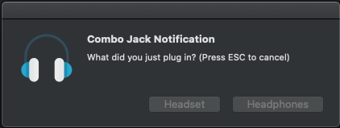

# **ComboJack dành cho Dell series**

Một cửa sổ sẽ bật lên để bạn chọn loại giắc cắm là Headset hay Headphones. 

    

# **Hỗ trợ các ALC:**

+ ALC255
+ ALC256
+ ALC295 (Dell Inspiron 7590/7591)
+ ALC298

# Tình trạng

+ Hiện tại chỉ hỗ trợ chế độ Headset và chế độ Headphones

# **Cài đặt**
1. Copy VerbStub.kext vào kext folder

    - Với **Clover**: EFI/Clover/kext/Other
    - Với **Opencore**: EFI/OC/kext, **nhớ snap lại config**

2. Chạy "install.sh" trong ComboJack_Installer/install.sh, Sau đó ComboJack sẽ được cài đặt.

# **Thêm codec bạn muốn**
+ Hãy đến đây: [i want more codec](https://github.com/torvalds/linux/blob/master/sound/pci/hda/patch_realtek.c)
+ Hãy thử tìm codec của bạn và thêm nó vào hda-verb.m trong dự án

# **More**

- Phiên bản này chỉ là bản reup + translate từ https://github.com/lvs1974/ComboJack
- Hãy download ComboJack tại Release.
